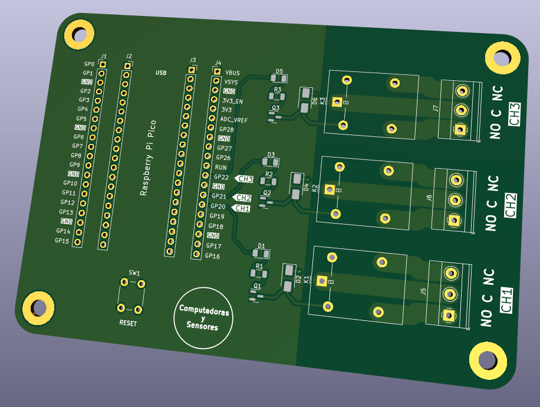

# Pico Carrier Relay

Un placa de desarrollo para Raspberry Pi Pico/W con 3 canales de relé (relay) incorporados controlado mediante GPIOs y borneras para una fácil conexión a circuitos externos de continua y alterna.
También expone todos los GPIO de la placa para una fácil conexión de dispositivos adicionales y un pulsador de reset.

Todos los archivos de diseño en Kicad se encuentran publicados junto a un código de ejemplo en MicroPython

# Fabricación

Dentro de la carpeta `fab` encontrarás el archivo `Pico-Carrier-Relay-Fab.zip` que incluye los Gerber y archivos de perforación .drl todo listo para ordenar a tu fabricante de PCB favorito.
Para solicitar el servicio de ensamble (PCBA) en dicha carpeta `fab` encontrarás el archivo `Pico-Carrier-Relay-BOM.csv` con el listado de materiales (BOM) y el archivo `Pico-Carrier-Relay-PnP.zip` para las coordenadas
de ubicación de componentes PnP (Pick and Place).

# Paso a paso

La explicación completa la podrás ver en el siguiente video de Youtube:
https://youtube.com/c/computadorasysensores
